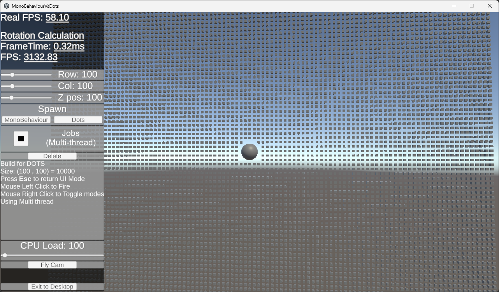

# MonoBehaviour vs DOTS: Spinning Cubes Showdown

A Unity-based project demonstrating the performance differences between traditional **MonoBehaviour** workflows and the **Unity DOTS (Data-Oriented Technology Stack)**. This project explores how Unity handles large-scale object manipulation, with a focus on multi-threading and entity-based architecture.

##  Description

This project highlights:

- The power of **Unity DOTS** for handling thousands of entities efficiently.
- A performance comparison between **MonoBehaviour** and **DOTS**, in both single-threaded and multi-threaded setups.
- Real-time FPS tracking for both application performance and calculation performance (rotation calculations).

##  Features

- **Interactive Spawning**:
  - Spawn up to **250,000 cubes** using MonoBehaviour or DOTS.
  - Adjust parameters like rows, columns, and spacing.

- **Performance Comparison**:
  - Toggle between **single-threaded** and **multi-threaded** execution.
  - Visualize FPS for real-time performance and rotation calculations.

- **Dynamic Controls**:
  - Sleek, user-friendly HUD for easy parameter adjustments.
  - Switch between MonoBehaviour and DOTS systems seamlessly.

- **Fly Cam**:
  - Explore the scene with full camera control.
  - Fire projectiles to interact with spawned cubes.

- **High Optimization**:
  - Built with low-quality settings for high performance.
  - Configured to run uncapped for optimal FPS demonstration.

##  Controls

### HUD Controls

| **Control**           | **Description**                                              |
|------------------------|--------------------------------------------------------------|
| `Row`                 | Number of cube rows to spawn (1 - 500).                      |
| `Col`                 | Number of cube columns to spawn (1 - 500).                   |
| `Z Pos`               | Z-axis distance for spawning cubes (10 - 500).               |
| `MonoBehaviour` Button| Spawn cubes using MonoBehaviour.                             |
| `DOTS` Button         | Spawn cubes using Unity DOTS.                                |
| `Jobs (Multi-thread)` | Enable/disable multi-threading for both systems.             |
| `Delete` Button       | Remove all spawned cubes and projectiles.                    |
| `CPU Load`            | Adjust the CPU processing intensity for calculations.        |
| `Fly Cam`             | Enable free camera movement for scene exploration.           |

### Fly Cam Controls

| **Control**            | **Action**                                                   |
|-------------------------|-------------------------------------------------------------|
| `Mouse`               | Look around.                                                |
| `Left Mouse Click`    | Fire a projectile (MonoBehaviour/DOTS based).                |
| `Right Mouse Click`   | Return to HUD.                                              |
| `W/A/S/D`             | Move forward, left, backward, and right.                    |
| `Esc`                 | Return to HUD.                                              |

##  What This Demonstrates

- **MonoBehaviour**:
  - Performance with large datasets.
  - Limited scalability compared to DOTS.

- **DOTS**:
  - Efficient entity management for massive datasets.
  - Performance boosts with multi-threading.

##  Technical Details

### Unity Version

- Built with **Unity 6.0 (v6000.00.30f1)**.

### Frameworks

- **MonoBehaviour**: Traditional Unity scripting.
- **DOTS**: Data-oriented technology stack for optimized performance.

### Systems

- **Real FPS Tracking**: Application-wide FPS.
- **Rotation Calculation FPS**: Specific FPS tracking for rotation calculations.

### Build Configurations

- **Platform**: Standalone Windows 64-bit (default to 720p resolution, windowed mode).
- **Performance Settings**:
  - Target frame rate: **500 FPS** (uncapped where possible).
  - Quality level: **Low**.

##  Installation & Usage

1. **Download the executable** from the [Releases section](https://github.com/MegaDyne2/MonoBehaviourVsDots/releases).
2. Extract the `.zip` file to your desired location.
3. Run the `MonoBehaviourVsDots.exe` file.

##  Screenshots

##  Future Enhancements

- Linux build
- Interaction between MonoBehaviour Bullets and DOTS Cubes
- Interaction between DOTS Bullets and MonoBehaviour Cubes

##  Acknowledgments

- Special thanks to the following YouTube creators for inspiring this project:
  - [Brackeys: Unity DOTS Crash Course](https://www.youtube.com/watch?v=HHeuXgu7It8)
  - [Code Monkey: Unity DOTS Beginner's Guide](https://www.youtube.com/watch?v=4ZYn9sR3btg)
- Unity Technologies for providing an excellent development environment.
- Developed by **David To**.

##  License

This project is licensed under the [MIT License](LICENSE).
